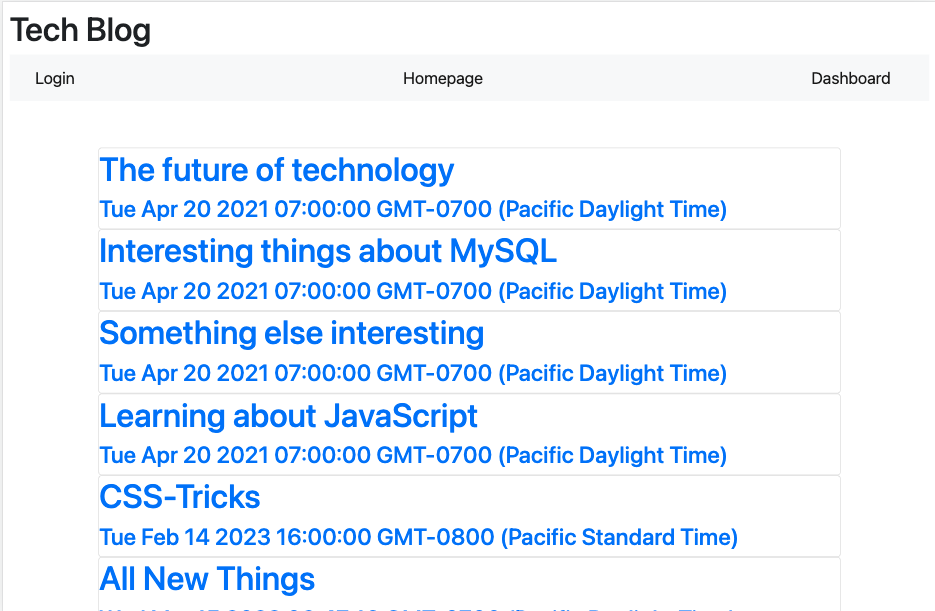
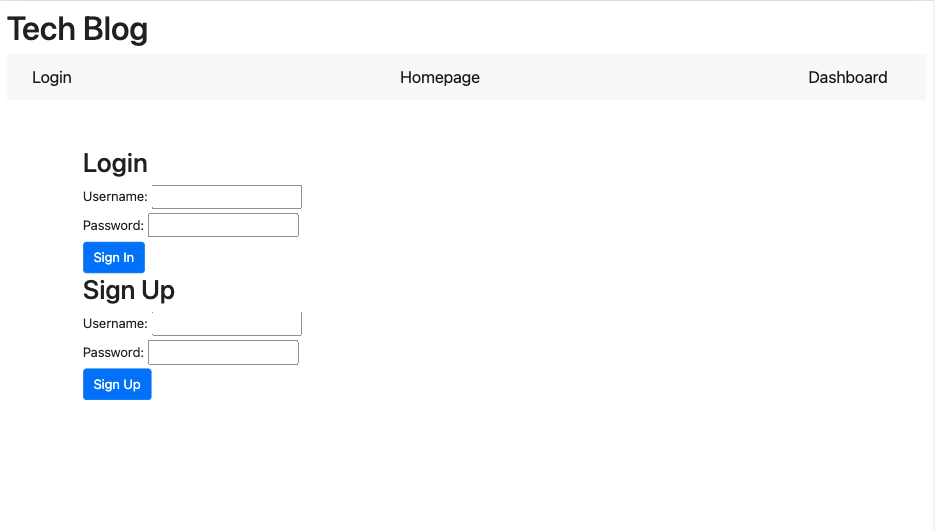

# Tech Blog


## Technology Used 

| Technology Used         | Resource URL           | 
| ------------- |:-------------:| 
| HTML    | [developer.mozilla.org](https://developer.mozilla.org/en-US/docs/Web/HTML) |      |   
| Git | [git-scm.com](https://git-scm.com/)     |    
| Node.js | [nodejs.org/docs](https://nodejs.org/docs/latest-v16.x/api/) |
| Heroku | [devcenter.heroku.com](https://devcenter.heroku.com/categories/reference)
| Express.js | [expressjs.com](https://expressjs.com/en/guide/routing.html)


## Description

[Visit the Deployed Site](https://tech-blog-platform.herokuapp.com/)


    
This project is a blog hosting site where people can view and interact with other other blog posts. People can comment on other's blog posts as well as create their own. If a user selects the dashboard from the navbar, then they can see all of the blog posts that they have created. They also have the option to create their own. 

I did this project to gain experience with the MVC framework as well as to practice creating a fullstack application. 


  ## Table of Contents
- [Tech Blog](#tech-blog)
  - [Technology Used](#technology-used)
  - [Description](#description)
  - [Table of Contents](#table-of-contents)
  - [Code Example](#code-example)
  - [Usage](#usage)
  - [Author Info](#author-info)
    - [Megan Ellman](#megan-ellman)
  - [Credits](#credits)
  - [License](#license)
  - [Questions](#questions)

## Code Example

```
router.post('/', async (req, res) => {
    try {
        const userPassword = await bcrypt.hash(req.body.password, 10)
        const userData = await User.create({
            username: req.body.username,
            password: userPassword,
        });

        req.session.save(() => {
            req.session.loggedIn = true;
            req.session.username = req.body.username;
            req.session.userId = userData.id;
            res.status(204).json(userData);
        });
    } catch (err) {
        console.log(err);
        res.status(500).json(err);
    }
})
```
Here I created a route to create a new instance of a user. When a user fills out the signup form and clicks the submit button, the user's information is collected on the client side and then sent to the backend here where the post route is run. Here bcrypt encrypts the password and that and the username are saved to the userData variable. 



## Usage
  
This project can be used for saving and referrencing notes.

## Author Info

### Megan Ellman

[LinkedIn](https://www.linkedin.com/in/megan-ellman/)

[GitHub](https://github.com/megellman)

[Portfolio](https://megellman.github.io/portfolio/)
    
## Credits
    
- [Heroku](https://devcenter.heroku.com/categories/reference)
- [Node.js](https://nodejs.org/docs/latest-v16.x/api/)
    
## License
  
  This project is covered under the MIT license. For more information please click [here](https://choosealicense.com/)

## Questions

[GitHub](github.com/megellman)

If you have any additional questions, you can reach me at meganlellman@gmail.com